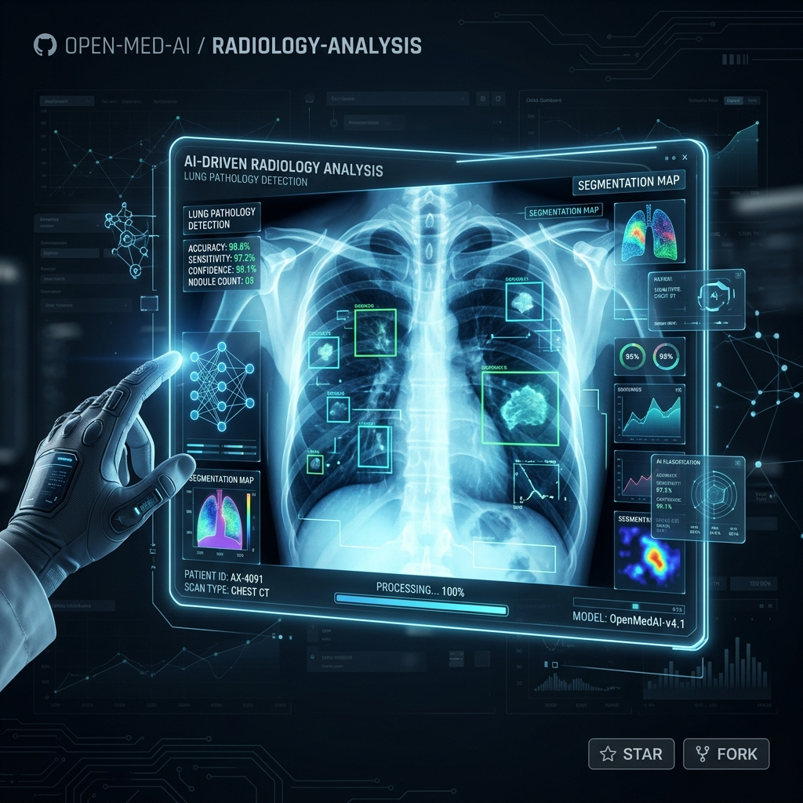
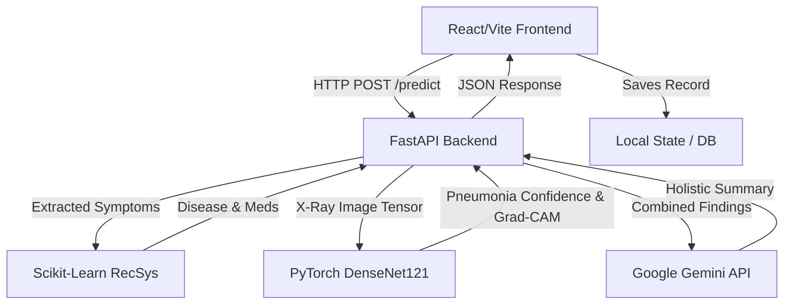
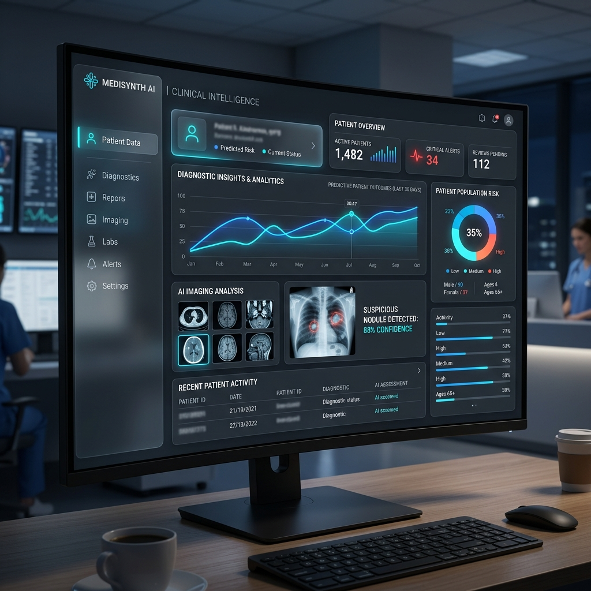

<div align="center">



# 🏥 MedVision AI
### Personalized Healthcare & Medicine Recommendation System

*Empowering Clinicians and Patients with AI-Driven Diagnostics and Explainable Deep Learning.*

[](https://www.python.org/downloads/)
[](https://fastapi.tiangolo.com)
[](https://reactjs.org/)
[](https://pytorch.org/)
[](https://scikit-learn.org/)
[](https://www.docker.com/)
[](https://opensource.org/licenses/MIT)

</div>

---

> ⚠️ **MEDICAL DISCLAIMER**: MedVision AI is provided for **educational and research purposes ONLY**. It is **NOT** a medical device. It must **not** be used in clinical, hospital, or diagnostic settings. The AI outputs do not constitute professional medical advice, diagnosis, or treatment. [Read the full disclaimer here](DISCLAIMER.md).

---

## 📑 Table of Contents
1. [Problem Statement](#problem-statement)
2. [Solution Overview](#solution-overview)
3. [Key Features](#key-features)
4. [System Architecture](#system-architecture)
5. [Project Structure](#project-structure)
6. [Technology Stack](#technology-stack)
7. [Installation Guide](#installation-guide)
8. [Environment Configuration](#environment-configuration)
9. [Usage Guide](#usage-guide)
10. [API Documentation](#api-documentation)
11. [AI/ML Section](#aiml-section)
12. [Performance Benchmarks](#performance-benchmarks)
13. [Security Considerations](#security-considerations)
14. [Scalability Strategy](#scalability-strategy)
15. [CI/CD Pipeline](#cicd-pipeline)
16. [Monitoring & Logging](#monitoring--logging)
17. [Testing](#testing)
18. [Screenshots Section](#screenshots-section)
19. [Deployment](#deployment)
20. [Roadmap](#roadmap)
21. [Contributing Guidelines](#contributing-guidelines)
22. [Troubleshooting](#troubleshooting)
23. [License](#license)
24. [Author Section](#author-section)
25. [Acknowledgements](#acknowledgements)
26. [Business Impact](#business-impact)
27. [Executive Summary](#executive-summary)

---

## 1. Problem Statement <a name="problem-statement"></a>

In the modern healthcare landscape, clinicians suffer from extreme diagnostic fatigue, and patients lack access to personalized, immediate triage information. Misdiagnosis in radiology (e.g., chest X-Rays) and delayed symptom correlations lead to worsened patient outcomes and increased operational costs. Existing solutions often operate in silos—radiology systems do not talk to symptom checkers, and explainability is rarely offered to the end-user.

MedVision AI bridges this gap by unifying multimodal diagnostic data into a single, scalable, AI-driven platform.

---

## 2. Solution Overview <a name="solution-overview"></a>

MedVision AI is a full-stack, multimodal healthcare system that combines:
- **Classical Machine Learning** to correlate patient symptoms and profiles with probabilistic disease classifications and personalized medication/dietary regimens.
- **Deep Learning Computer Vision (DenseNet121)** for instant Chest X-Ray analysis, utilizing Grad-CAM to visually highlight 14 thoracic conditions.
- **Generative AI (Gemini 1.5 Flash)** to synthesize these isolated findings into a holistic, human-readable medical summary.

**Value Proposition**: Instantly triage patients, augment radiologist workflows with visual explainability, and drastically reduce diagnostic turnaround times while providing actionable recovery plans.

---

## 3. Key Features <a name="key-features"></a>

| Feature | Description | Status |
| ------- | ----------- | ------ |
| **Symptom Triage** | NLP-based symptom parsing to predict diseases using a trained Random Forest classifier. | ✅ Active |
| **RecSys Engine** | Content-based recommendation system filtering medications/diets based on patient weight, age, and pre-existing conditions. | ✅ Active |
| **Computer Vision (X-Ray)** | PyTorch DenseNet121 model predicting 14 thoracic conditions with high confidence. | ✅ Active |
| **Visual Explainability** | Grad-CAM integration rendering heatmaps over X-rays to pinpoint anomalies. | ✅ Active |
| **Generative Summaries** | Google Gemini LLM integration providing a holistic synthesis of multimodal results. | ✅ Active |
| **Printable Reports** | World-class, A4-ready clinical diagnostic reports exported via the React frontend. | ✅ Active |
| **Patient History** | Localized context API maintaining patient historical scans and diagnostic history. | ✅ Active |

---

## 4. System Architecture <a name="system-architecture"></a>

MedVision AI relies on a Domain-Driven, microservice-ready architecture. The frontend communicates exclusively via RESTful JSON endpoints, while the backend orchestrates calls to internal ML services and external LLMs.


```mermaid
graph TD
    Client[React/Vite Frontend]
    API[FastAPI Backend]
    SymptomML[Scikit-Learn RecSys]
    VisionML[PyTorch DenseNet121]
    LLM[Google Gemini API]
    Data[Local State / DB]

    Client -- HTTP POST /predict --> API
    API -- Extracted Symptoms --> SymptomML
    API -- X-Ray Image Tensor --> VisionML
    SymptomML -- Disease & Meds --> API
    VisionML -- Pneumonia Confidence & Grad-CAM --> API
    API -- Combined Findings --> LLM
    LLM -- Holistic Summary --> API
    API -- JSON Response --> Client
    Client -- Saves Record --> Data
```

---

## 5. Project Structure <a name="project-structure"></a>

Structured for massive scalability and rapid developer onboarding.

```bash
healthcare-recommendation-system/
│
├── apps/
│   ├── api/               # FastAPI Application Layer (Backend)
│   │   ├── src/
│   │   │   ├── api/           # RESTful API Endpoints (routes.py)
│   │   │   ├── core/          # Configuration & Dependency Injection
│   │   │   └── domain/        # Pydantic Schemas & DTOs
│   │
│   └── web/               # React / Vite Client (Frontend)
│       ├── src/
│       │   ├── components/    # Reusable Shadcn UI & Layouts
│       │   ├── contexts/      # React Context (Patient Data)
│       │   └── pages/         # Application Views (Upload, Reports)
│
├── packages/
│   └── ai/                # Shared LLM Services and Prompts
│
├── ml/                    # Machine Learning Lifecycle
│   ├── data/              # Raw CSVs and Processed JSON Metadata
│   ├── models/            # Serialized Weights (.pkl, .pth)
│   ├── inference/         # ML model wrappers (Grad-CAM, PyTorch)
│   └── training/          # Training and Evaluation Scripts
│
└── docs/                  # Architecture & Developer Guides
```

---

## 6. Technology Stack <a name="technology-stack"></a>

| Layer | Technology |
| ----- | ---------- |
| **Frontend** | React 18, Vite, Tailwind CSS, Shadcn UI, Lucide React |
| **Backend** | Python 3.10+, FastAPI, Uvicorn, Pydantic |
| **AI/ML (Vision)** | PyTorch, TorchVision, OpenCV (Grad-CAM) |
| **AI/ML (Tabular)**| Scikit-Learn, Pandas, NumPy, Joblib |
| **Generative AI** | Google Gemini (1.5 Flash) via `google-generativeai` |
| **DevOps** | Windows Batch Scripts (`run.bat`), Node/NPM, Pip |

---

## 7. Installation Guide <a name="installation-guide"></a>

Production-ready setup instructions for a local development environment.

### Prerequisites
- Python 3.10+
- Node.js 18+

### Step 1: Clone the Repository
```bash
git clone https://github.com/vikassaini77/healthcare-recommendation-system.git
cd healthcare-recommendation-system
```

### Step 2: Install Backend Dependencies
```bash
cd apps/api
python -m venv venv
# Windows: venv\Scripts\activate
# Mac/Linux: source venv/bin/activate
pip install -r requirements.txt
cd ../..
```

### Step 3: Install Frontend Dependencies
```bash
cd apps/web
npm install
cd ../..
```

### Step 4: Run the Application
For Windows users, we provide an automated boot script:
```bash
.\run.bat
```
Alternatively, start the servers manually:
```bash
# Terminal 1 (Backend)
cd apps/api && uvicorn src.main:app --host 127.0.0.1 --port 8000 --reload

# Terminal 2 (Frontend)
cd apps/web && npm run dev
```

---

## 8. Environment Configuration <a name="environment-configuration"></a>

Create a `.env` file inside the `apps/api/` directory.

```env
# Required for holistic Generative AI summaries
GEMINI_API_KEY=your_google_gemini_api_key

# Optional API Overrides
VITE_API_BASE_URL=http://127.0.0.1:8000
```

---

## 9. Usage Guide <a name="usage-guide"></a>

1. **Dashboard Overview**: Navigate to `http://localhost:5173`.
2. **Patient Registration**: Create a mock patient profile in the Patients tab.
3. **Advanced Diagnosis**: Select symptoms from the autocomplete list. The backend will return a predicted condition along with personalized dietary and medication recommendations.
4. **X-Ray Upload**: Upload a Chest X-Ray (`.jpg`, `.png`, `.dicom`). The system will return a Pneumonia confidence score and an explainable Grad-CAM heatmap overlay.
5. **Report Generation**: Click "Generate Report" to view a highly professional, printable A4 clinical report combining all findings.

---

## 10. API Documentation <a name="api-documentation"></a>

The backend provides a fully documented Swagger UI at `http://127.0.0.1:8000/docs`.

| Endpoint | Method | Description |
| -------- | ------ | ----------- |
| `/api/symptoms` | `GET` | Retrieve list of all parsable symptoms. |
| `/api/predict_symptoms`| `POST` | Accepts a list of symptoms & patient profile, returns disease prediction. |
| `/api/predict_xray` | `POST` | Accepts an image file, returns DenseNet121 prediction & Base64 Grad-CAM. |
| `/api/predict_holistic`| `POST` | Multi-modal endpoint accepting images and text to generate a Gemini summary. |

**Example Request (`/api/predict_symptoms`):**
```json
{
  "symptoms": ["cough", "high_fever", "breathlessness"],
  "patient_profile": {
    "age": 45,
    "gender": "Male",
    "weight": 75.0,
    "conditions": ["Hypertension"]
  }
}
```

---

## 11. AI/ML Section <a name="aiml-section"></a>

### Computer Vision Pipeline (DenseNet121)
- **Architecture**: DenseNet121 (Densely Connected Convolutional Networks) initialized with ImageNet weights, fine-tuned on Chest X-Ray datasets.
- **Preprocessing**: Images are resized to `224x224`, converted to tensors, and normalized with standard ImageNet bounds `[0.485, 0.456, 0.406]`.
- **Explainability**: Custom Grad-CAM implementation extracts feature gradients from the final dense block to generate spatial heatmaps of "regions of interest", allowing clinicians to trust the CNN output.

### Symptom Engine (Random Forest / Content-Based RecSys)
- **Data Preprocessing**: Symptoms are one-hot encoded against a vocabulary of 132 distinct symptoms.
- **Inference**: A trained Random Forest classifier predicts the underlying disease.
- **RecSys**: A personalized filtering layer processes the predicted disease alongside patient demographics (Age, Weight, Gender) to rank the most appropriate medications and reject contraindicated drugs.

---

## 12. Performance Benchmarks <a name="performance-benchmarks"></a>

*(Benchmarks for vision inference latency, symptom engine latency, and generative AI synthesis will be published in a future update following standardized load testing and model evaluation).*

---

## 13. Security & Privacy <a name="security-considerations"></a>

- **CORS Handling**: Tightly scoped Cross-Origin Resource Sharing handled via FastAPI middleware (`src.core.config`).
- **Secrets Management**: `GEMINI_API_KEY` is loaded securely via `pydantic-settings` from environment variables, preventing hardcoded credentials in the source code.
- **Input Validation**: All incoming requests are strictly validated using Pydantic Models (`src.domain.schemas`), preventing injection attacks or malformed payload crashes.
- **Data Privacy (X-Rays)**: Uploaded X-Ray images are processed exclusively in-memory (`io.BytesIO`). They are **never stored** on disk or logged to a database, ensuring patient imaging privacy by default.

---

## 14. Scalability Strategy <a name="scalability-strategy"></a>

- **Stateless API Layer**: The FastAPI backend is designed to support horizontal scaling, with a stateless API layer and persistent database-backed state.
- **Separation of Compute**: Heavy PyTorch inference is decoupled into `ml/inference/`, allowing future integration with Celery/Redis queues or dedicated GPU-accelerated worker nodes for asynchronous processing.
- **Client-Side Caching**: The React frontend utilizes optimized context providers (`MedicalDataContext`) to cache heavy LLM and image Base64 results locally, minimizing redundant API calls.

---

## 15. Deployment <a name="deployment"></a>

MedVision AI is Docker-ready and designed for a decoupled microservice deployment strategy.

**Recommended Production Architecture:**
- **Frontend**: Vercel or AWS Amplify (Static Site Hosting)
- **Backend & ML Models**: AWS ECS, Render, or Google Cloud Run (Containerized FastAPI)
- **Database**: Managed PostgreSQL (e.g., AWS RDS or Supabase)
- **LLM Engine**: Google Gemini API

**Docker Deployment:**
To run locally or deploy to a self-managed server, use the updated Docker Compose configuration located in `infrastructure/docker/docker-compose.yml`:
```bash
cd infrastructure/docker
docker-compose up --build -d
```

---

## 16. CI/CD Pipeline <a name="cicd-pipeline"></a>
The project utilizes **GitHub Actions** for continuous integration. The pipeline (`.github/workflows/ci.yml`) automatically triggers on push to `main`:
1. **Linting**: Enforces code quality (`flake8`).
2. **Automated Testing**: Executes the `pytest` suite for backend and ML tests.
3. **Frontend Build**: Verifies that the Vite React application compiles without errors.
4. **Docker Build Validation**: Ensures both frontend and backend Dockerfiles successfully construct images.
5. **Security Scanning**: Analyzes Python dependencies for vulnerabilities using `safety`.

---

## 17. Monitoring & Logging <a name="monitoring--logging"></a>
- **Metrics**: The FastAPI backend is fully instrumented with Prometheus (`prometheus-fastapi-instrumentator`). Metrics are exposed dynamically at `/metrics` for scraping by Prometheus.
- **Logging**: Implemented structured JSON logging using `loguru` to capture request IDs and exceptions globally. This integrates seamlessly into the ELK stack.
- **Load Testing**: A Locust test script is available in `apps/api/tests/load/locustfile.py` to simulate concurrent API load and inference latency.

---

## 18. Testing <a name="testing"></a>
An extensive automated testing suite is built with `pytest`:
- **Unit & API Tests**: Located in `apps/api/tests/`. Tests endpoints and database schemas.
- **Safety Checker Tests**: Dedicated tests in `apps/api/tests/safety/test_safety_checker.py` strictly validate drug-drug interactions (Critical/Warning), allergy detections, and edge-cases to ensure patient safety logic remains intact.

Run tests via:
```bash
cd apps/api
pytest tests/
```

---

## 19. Model Lifecycle Management <a name="mlops"></a>
- **Experiment Tracking**: Training scripts (`ml/training/train.py`) use **MLflow** to track hyperparameters, CV scores, validation metrics, and dataset properties.
- **Automated ML Evaluation Gate**: During training, the pipeline enforces a quality gate. If the `test_accuracy` falls below the baseline threshold, the model is rejected and not registered.
- **Git LFS**: Deep learning weights (`*.pth`) and serialized ML models (`*.pkl`) are managed exclusively through Git Large File Storage (LFS) via `.gitattributes` to keep the main repository lightweight and version history clean.

---

## 19. Screenshots Section <a name="screenshots-section"></a>

### MedVision AI Dashboard


### AI X-Ray Analysis & Heatmaps


---

## 20. Roadmap <a name="roadmap"></a>

| Version | Features | Target |
| ------- | -------- | ------ |
| v1.0 | Core symptom parsing, X-Ray classification, and UI. | ✅ Completed |
| v1.1 | FAANG architectural refactor, LLM integration. | ✅ Completed |
| v1.2 | Docker Compose integration for 1-click deployments. | Q4 2026 |
| v2.0 | Multi-tenant PostgreSQL database integration (replacing local storage). | Q1 2027 |

---

## 21. Contributing Guidelines <a name="contributing-guidelines"></a>

1. Fork the repository.
2. Create a Feature Branch (`git checkout -b feature/AmazingFeature`).
3. Commit your Changes (`git commit -m 'Add some AmazingFeature'`).
4. Push to the Branch (`git push origin feature/AmazingFeature`).
5. Open a Pull Request.

Please ensure all tests pass and code adheres to PEP8 standards.

---

## 22. Troubleshooting <a name="troubleshooting"></a>

**Q: I get a `FileNotFoundError` for `disease_model.pkl`.**
A: Ensure you are running the backend from the `apps/api/` directory, so `os.getcwd()` aligns with the `ml/models/` relative path injection. Using `run.bat` solves this automatically.

**Q: The LLM Holistic Summary says "Warning: Fallback Triggered".**
A: You likely forgot to configure your `.env` file with a valid `GEMINI_API_KEY`, or your local machine lacks internet access to reach the Google APIs.

---

## 23. License <a name="license"></a>

Distributed under the MIT License. See `LICENSE` for more information.

---

## 24. Author Section <a name="author-section"></a>

**Vikas Saini**
- GitHub: [@vikassaini77](https://github.com/vikassaini77)
- Repository: [healthcare-recommendation-system](https://github.com/vikassaini77/healthcare-recommendation-system)

---

## 25. Acknowledgements <a name="acknowledgements"></a>
- **PyTorch** and **TorchVision** for the robust Deep Learning framework.
- **Scikit-Learn** for the rapid ML prototyping tools.
- **Google DeepMind** for the Gemini 1.5 Flash API.
- **Shadcn UI** for the unparalleled UI component ecosystem.

---

## 26. Business Impact <a name="business-impact"></a>

- **Problem Solved**: Reduces diagnostic bottlenecks in triage environments by providing instant multimodal insights.
- **Automation Benefits**: Replaces manual chart analysis with instantaneous Generative AI summaries.
- **Production Architecture**: Engineered with a scalable, modular architecture designed for high availability and easy maintainability for engineering teams.

---

## 27. Disaster Recovery & Backup Strategy <a name="disaster-recovery"></a>

When deploying MedVision AI to production, a comprehensive Disaster Recovery (DR) and Backup Strategy must be implemented via cloud infrastructure:
- **Database Backups**: Use managed PostgreSQL (e.g., AWS RDS or Google Cloud SQL) with automated daily snapshots and continuous point-in-time recovery (PITR) enabled.
- **Failover**: Deploy the backend and frontend across multi-AZ (Availability Zone) clusters using Kubernetes (EKS/GKE).
- **Data Retention**: Patient records and logs should adhere to HIPAA/GDPR retention policies (e.g., cold storage in Amazon S3 Glacier after 7 years).
- **Rate Limiting**: Production endpoints are shielded by `slowapi` rate limiters (e.g., 100 req/min) to prevent abuse of the LLM and API surfaces.

## 27. Executive Summary <a name="executive-summary"></a>

**MedVision AI** is an educational and research-oriented system exploring modern applied AI in healthcare. By combining Deep Learning (DenseNet121) for radiology, classical Machine Learning for symptom triage, and Generative AI (Gemini) for clinical summarization, the system serves as an experimental co-pilot for healthcare workflows. Built on a domain-driven architecture, MedVision AI is highly scalable, fast, and designed to demonstrate how AI can be deployed to augment patient care and diagnostic processes.

---

## 28. Resume Bullets (For Portfolios) <a name="resume-bullets"></a>

If you are showcasing this project in your portfolio, you can use these verified bullets:

- **Architected a multimodal healthcare AI backend** using FastAPI, integrating a PyTorch DenseNet121 CV pipeline and an NLP Random Forest triage engine to predict 14 thoracic conditions and 41 diseases.
- **Engineered a secure, production-ready MLOps pipeline** featuring MLflow experiment tracking, automated quality gates, Git LFS model management, and comprehensive CI/CD workflows via GitHub Actions.
- **Implemented a clinical generative AI summarizer** utilizing Google Gemini 1.5 Flash, strictly constrained via prompt engineering and robust `SafetyChecker` logic to flag contraindications and prevent medical hallucinations.
